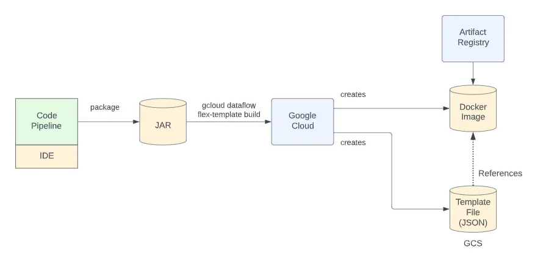

# Flex Templates 

Dataflow Flex Templates, we can use to define a Dataflow pipeline that can be executed either from a request from the Cloud Console, gcloud or through a REST API call. Through the REST API, that then opens up the possibility to start a job through Cloud Scheduler or many other mechanisms.

Flex Templates creates two artifacts for us that allows us to launch a Dataflow job. These are a Docker image and a JSON file that is stored in Google Cloud Storage (GCS).

```python
gcloud dataflow flex-template build
```

This command takes as input :

* The `GCS path` to the template file that will be created
* The `base Docker Image` to use as the base for building the Docker Image
* The `artifact repository` that will hold the built Docker Image
* The `pre-compiled code` and dependencies `requirements.txt` for the Beam pipeline

When the command is run, it will create *both* the **Docker Image** and the corresponding **template file.**

The overall diagram looks as follows:



### Pre-Requisuites for Flex Template

What are the per-requisites required to go through the flec template build and run :

1. **Create a project :** We create a GCP project for our tests. You can re-use an existing one if you desire.
2. **Enable services :** In our test, since we created a new project, none of the services are pre-enabled and we will enable the ones we need.

* Compute Engine
* Dataflow
* Artifact Registry
* Cloud Build

3. **Create a GCS bucket :** We need to create a GCS bucket that will hold our Flex Template GCS file.
4. **Create a VPC network :** I recommend not using the default VPC network (if you have one) and created a new VPC network called `myvpc`.
5. **Create a service account for the worker :** When Dataflow runs, it creates Compute Engines that run as workers. These must run as a service account and here we create a new service account that they will run as. I called mine“worker”.
6. **Grant the worker Dataflow Worker :** "To be able to perform the role of a Dataflow Worker, the newly created service account must be granted Dataflow Worker role.
7. **Create a docker repo :** A Docker Image will be created and we need a repo in which to store it. We called this repo “`myrepo`”.
8. **Grant the worker Artifact Registry Reader on the repo :** The worker service account is the service account that the launcher runs as. It must have permissions to read from the artifact registry. We grant it the reader role.


### Create a Cloud Storage bucket

```shell
export BUCKET="your--bucket"
gsutil mb gs://$BUCKET
```

### Create an Artifact Registry repository

Create an Artifact Registry repository where you will push the Docker container image for the template.

Use the `gcloud artifacts repositories create` command to create a new Artifact Registry repository.

**Replace the following:**

-`REPOSITORY`: a name for your repository. Repository names must be unique for each repository location in a project.

-`LOCATION`: the regional or multi-regional location for the repository.

```shell
export REGION="us-central1"
export REPOSITORY="your-repository"

gcloud artifacts repositories create $REPOSITORY \
    --repository-format=docker \
    --location=$REGION
```

### Configure Docker

Use the `gcloud auth configure-docker` command to configure Docker to authenticate requests for Artifact Registry.

This command updates your `Docker Configuration`, so that you can connect with Artifact Registry to push images.

**Flex Templates** can also use images stored in private registries. For more information, see Use an image from a private registry. [Image from a private Registry](https://cloud.google.com/dataflow/docs/guides/templates/configuring-flex-templates#use_an_image_from_a_private_registry)

```python
gcloud auth configure-docker $REGION-docker.pkg.dev
```

### Build the Flex Template

In this step, you use the gcloud dataflow flex-template build command to build the Flex Template.

**A Flex Template consists of the following components:**

- A Docker container image that packages your pipeline code. For Java and Python Flex Templates, the Docker image is built and pushed to your Artifact Registry repository when you run the `gcloud dataflow flex-template build` command.
- A template specification file. This file is a JSON document that contains the location of the container image plus metadata about the template, such as pipeline parameters.

```python
gcloud dataflow flex-template build gs://BUCKET_NAME/flex-template-py.json \
--image-gcr-path f"{REGION}-docker.pkg.dev/{PROJECT}/{REPOSITORY}/flex-python:latest" \
--sdk-language "PYTHON" \
--flex-template-base-image "PYTHON3" \
--metadata-file "metadata.json" \
--py-path "." \
--env "FLEX_TEMPLATE_PYTHON_PY_FILE=flex_python.py" \
--env "FLEX_TEMPLATE_PYTHON_REQUIREMENTS_FILE=requirements.txt" \
--service-account-email gcp_service_account_name
```

### Run The Flex Template

In this step, we use the flex template to run a dataflow job.

Use the `gcloud dataflow flex-template run` command to run a Dataflow job that uses the Flex Template.

Replace the following:

-`BUCKET_NAME`: the name of the Cloud Storage bucket that you created earlier

-`REGION`: the region

To view the status of the Dataflow job in the Google Cloud console, go to the Dataflow Jobs page.

```python
gcloud dataflow flex-template run "flex-job-`date +%Y%m%d-%H%M%S`" \
--template-file-gcs-location "gs://BUCKET_NAME/flex-template-py.json" \
--parameters output="gs://BUCKET_NAME/output-" \
--region "REGION" \
--service-account-email gcp_service_account_name \
--staging_location gs://your_staging_bucket_location/ \
--subnetwork your_full_subnetwork_uri \
--num-workers 4 \
--max-workers 8 \
--disable-public-ips \
--worker-region us-central1 \
--worker-machine-type c2-standard-8 \
--parameters output='gs://your_bucket/output/'
```

### References & Links

* [Build and Create Flx Teamplate](https://cloud.google.com/dataflow/docs/guides/templates/using-flex-templates)
* [Confiiguing Flex Templates](https://cloud.google.com/dataflow/docs/guides/templates/configuring-flex-templates)
* [Flex Template Base Images](https://cloud.google.com/dataflow/docs/reference/flex-templates-base-images)
* [GCLOUD Dataflow flex-template run| Google](https://cloud.google.com/sdk/gcloud/reference/dataflow/flex-template/run)
