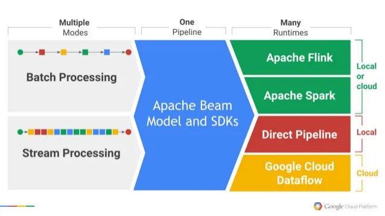

# Apache Beam

Apache Beam (**B**atch + Str**eam** = Beam) is a unified programming model that defines and executes both batch and streaming data processing jobs. It provides SDKs for running data pipelines and runners to execute them.

Apache Beam can provide value in use cases that involve data movement from different storage layers, data transformations, and real-time data processing jobs.

There are three fundamental concepts in Apache Beam, namely:

* `Pipeline` : encapsulates the entire data processing tasks and represents a directed acyclic graph(DAG) of **PCollection** and **PTransform.** It is analogous to Spark Context.
* `PCollection` : represents a data set which can be a fixed batch or a stream of data. We can think it of as a Spark RDD.
* `PTransform` : a data processing operation that takes one or more *PCollection*s and outputs zero or more *PCollection*s. It can be considered as a Spark transformation/action on RDDs to output the result.

Apache Beam is designed to enable pipelines to be portable across different runners. In the below example, the pipeline is executed locally using the DirectRunner which is great for developing, testing, and debugging.

### `Why choose Apache Beam`

First, Apache Beam is very effective, and it is effortless for use with Java as well as python. In contrast to Apache Spark, Apache Beam requires less configuration. Apache Beam is an open ecosystem, independent of any particular vendor, and run by a community. 

###### Beam has four essential components -

* `Pipeline` is a complete process consisting of steps that read, transform, and save data. It starts with the input (source or database table), involves transformations, and ends with the output (sink or database table). Transformation operations can include filtering, joining, aggregating, etc., and are applied to data to give it meaning and the form desired by the end user.
* `PCollection` is a specialized container of nearly unlimited size representing a set of data in the pipeline. PCollections are the input and the output of every single transformation operation.
* `PTransform` is a data processing step inside of your pipeline. Whatever operation you choose – data format conversion, mathematical computation, data grouping, combining, or filtering – you specify it, and a transform performs it on each element from PCollection. P in the name stands for parallel as transforms can operate in parallel in a large amount of distributed workers.
* `Runner` determines where the pipeline will operate.

###### Why Data Engineer's Use Beam -

* Data Engineers mostly used Beam so as to create Extract,Transform and Load (ETL) tasks and for Data Integration.
* It is also useful in embracing parallel data processing tasks.
* In data processing tasks, the problem decompose into smaller chunks and processed independently, in other words we are running Map-Reduce jobs.
* As a result,Apache Beam achieves parallel processing.

###### Features of Apache Beam -

* Unified – Single Programming for Batch + Streaming
* Extensible – Write and Share new SDKs,IO connectors and transformation libraries.
* Portable – Exectues pipelines on mutiple execution environment,
* Open Source – Community Based Developement

    

# Google Cloud Dataflow

The Google Cloud Platform ecosystem provides a serverless data processing service, Dataflow, for executing batch and streaming data pipelines. As a fully managed, fast, and cost-effective data processing tool used with Apache Beam, Cloud Dataflow allows users to develop and execute a range of data processing patterns, Extract-Transform-Load (ETL), and batch and streaming.

Data can be brought in from multiple data sources (CRM, Databases, REST API, file systems). A pipeline executed by Dataflow extracts and reads data, then transforms it, and finally writes it out, loading it into the cloud or on-premise storage.

Dataflow is a perfect solution for building data pipelines, monitoring their execution, and transforming and analyzing data, because it fully automates operational tasks like resource management and performance optimization for your pipeline. In Cloud Dataflow, all resources are provided on-demand and automatically scaled to meet requirements.

For example, one alternative is to run Apache Spark in Google Cloud Dataproc Service. So, why would you choose Dataflow? There are a few reasons -

1. **Serverless** : We don't have to manage computing resources. It automatically spins up and down a cluster of virtual machines while running the processing jobs. We can just focus on building the code instead of building the cluster. Apache Spark, on the other hand, requires more configuration even if it is running on Cloud Dataproc.
2. **Processing code is separate from the execution environment :** In 2016, Google donated open-source Dataflow SDK and a set of data connectors to access Google Cloud Platform which added additional features to the Apache Beam project. We can write beam programs and run them on the local system or Cloud Dataflow service. When we look at the Dataflow documentation, it suggests the Apache Beam website for the latest version of the Software Development Kit.
3. **Processing batch and stream mode with the same programming model :** Other Big data SDKs require different codes depending on whether data comes in batch or streaming form. On the other hand, Apache Beam addresses it with a unified programming model. Competitors like Spark are considering it but they are not quite there yet.

### `Why choose Dataflow`

There are other data processing platforms in addition to Dataflow. Google's Dataproc service is also an option, but Dataflow is serverless and automatically adds up clusters if needed along the way. Most importantly, Google intended Apache Beam programs to run on Dataflow or a user's own systems.

For standard data processing solutions, Google Cloud Dataflow provides quick-start templates. By eliminating the need to develop pipeline code, Cloud Dataflow templates facilitate pipeline building. Custom data processing solutions, however, require Apache Beam programming experience.

Google promotes Dataflow as one of the major components of a Big Data architecture on GCP. With the ability to extract data from open sources, this serverless solution is native to the Google Cloud Platform, enabling quick implementation and integration. Dataflow can also run custom ETL solutions since it has: building blocks for Operational Data Store and data warehousing; pipelines for data filtering and enrichment; pipelines to de-identify PII datasets; features to detect anomalies in financial transactions; and log exports to external systems.

#### `Summarizing`

Cloud Dataflow is a fully managed service for running Apache Beam pipelines on Google Cloud Platform. Cloud Dataflow executes data processing jobs. Dataflow is designed to run on a very large dataset, it distributes these processing tasks to several virtual machines in the cluster so that they can process different chunks of data in parallel. Cloud Dataflow is certainly not the first big data processing engine, its not the only one available on Google Cloud Platform.

**Conclusions for building an ETL pipeline can be summarized as follows -**

* Google Dataflow is a reliable, fast, and powerful data processing tool.
* Apache Beam is a programming model for data processing pipelines with rich DSL and many customization options.
* Using a serverless approach significantly accelerates data processing software development.
* Designing the ETL pipeline in the framework style enables users to create reusable solutions with self-service capabilities.
* Serverless and decoupled architecture is a cost-effective approach to accommodating the customer needs.

# References and Links

* [Apache Beam SDK - GitHub](https://github.com/apache/beam)
* [Apache Beam To Build Pipelines - GCP](https://cloud.google.com/dataflow/docs/guides/use-beam)
* [Apache Beam Programming Guide - Beam](https://beam.apache.org/documentation/programming-guide/)
* [Apache Beam Tour Guide Playground - Beam](https://tour.beam.apache.org/tour/python/introduction/guide)
* [Dataflow Templates - GCP](https://cloud.google.com/dataflow/docs/concepts/dataflow-templates)
* [Dataflow Templates - GitHub](https://github.com/GoogleCloudPlatform/DataflowTemplates)
* [GCP Dataflow Operator - Airflow](https://airflow.apache.org/docs/apache-airflow-providers-google/stable/operators/cloud/dataflow.html)
